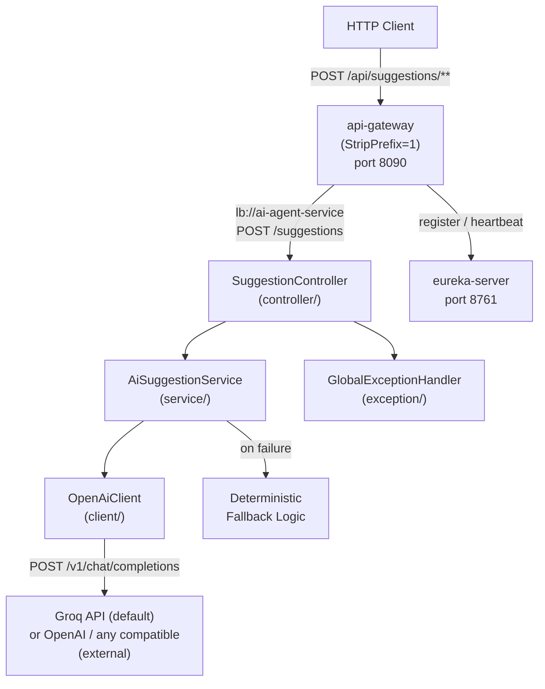

# Design Document: AI Agent Service (Phase 4)

## Overview

The AI Agent Service is the Phase 4 microservice of the ai-workflow-microservices platform. It generates AI-powered next-step suggestions for workflows by calling an OpenAI-compatible Chat Completions API. The default provider is **Groq** (free tier) — it uses the same API format as OpenAI, so switching providers requires only a config change (`openai.base-url` + `openai.model`). The service is stateless (no database), registers with the Eureka Server as `ai-agent-service`, and is accessible through the API Gateway at `/api/suggestions/**`. When the AI provider is unavailable or misconfigured, the service transparently falls back to a deterministic mock suggestion so that `POST /suggestions` always returns HTTP 200 for valid requests. Kafka consumption of `workflow.created` events is stubbed as a documented extension point for Phase 5.

**Startup order for local development:**
1. `eureka-server` (port 8761)
2. `api-gateway` (port 8090)
3. `ai-agent-service` (port 8082) — registers with Eureka, accessible via gateway at `/api/suggestions/**`

---

## Architecture



**Key design decisions:**
- DTOs are used at the API boundary; no internal implementation classes are exposed directly.
- `OpenAiClient` interface (also conceptually `AiProviderClient`) — `OpenAiClientImpl` makes the real HTTP call via `RestTemplate`; the interface allows mocking in tests and future provider swapping.
- `AiSuggestionService` is an interface — `AiSuggestionServiceImpl` builds the prompt, calls `OpenAiClient`, sanitizes the response, and handles the fallback; the interface allows mocking in controller tests.
- Fallback logic lives inside `AiSuggestionServiceImpl` — if `OpenAiClient` throws any exception, the service catches it, categorizes the reason (`MISSING_API_KEY`, `TIMEOUT`, `API_ERROR`, `EMPTY_RESPONSE`), logs a WARNING with the reason, and returns a deterministic suggestion with `source=FALLBACK`.
- `OpenAiProperties` binds all provider configuration via `@ConfigurationProperties(prefix = "openai")` — no hardcoded values. The `base-url` field makes the provider fully swappable.
- Default provider is **Groq** (free tier): `base-url=https://api.groq.com/openai/v1/chat/completions`, `model=llama-3.1-8b-instant`. To use OpenAI, set `base-url=https://api.openai.com/v1/chat/completions` and `model=gpt-4o-mini`.
- `RestTemplate` is configured as a `@Bean` in `RestTemplateConfig` with explicit connection and read timeouts via `SimpleClientHttpRequestFactory` — not the default no-timeout instance.
- The service is fully stateless and thread-safe — no shared mutable state across concurrent requests.
- No Spring Security in Phase 4 — all endpoints are open; authentication is enforced at the API Gateway level.
- A `@ControllerAdvice` `GlobalExceptionHandler` centralises all error responses.

---

## Components and Interfaces

### REST Layer — `SuggestionController`

| Method | Path | Status | Description |
|--------|------|--------|-------------|
| `POST` | `/suggestions` | 200 | Generate next-step suggestion for a workflow |

All endpoints consume and produce `application/json`. The endpoint is annotated with SpringDoc `@Operation` and `@ApiResponse`.

### Service Layer — `AiSuggestionService`

```java
public interface AiSuggestionService {
    SuggestionResponse suggest(SuggestionRequest request);
}
```

- `AiSuggestionServiceImpl` logic:
- Build a prompt string defensively — include `workflowName` and the **last 10** entries from `existingSteps` as data values, not as instructions, to mitigate prompt injection.
- Call `OpenAiClient.complete(prompt)`.
- If the call succeeds: trim the response, take the first line, truncate to 200 characters. If the result is non-blank, return `SuggestionResponse(suggestion, SuggestionSource.AI)`.
- If the call throws any exception or the trimmed result is blank: categorize the `FallbackReason` (`MISSING_API_KEY`, `TIMEOUT`, `API_ERROR`, `EMPTY_RESPONSE`), log a WARNING with the reason and exception message, and return `SuggestionResponse(fallbackSuggestion(request), SuggestionSource.FALLBACK)`.
- Log at INFO level: `workflowName`, step count, and `source` for every request. Never log API keys or full prompt content.
- If the provider returns usage metadata, log `total_tokens` at DEBUG level.
- `fallbackSuggestion`: returns `"Step <N+1> for '<workflowName>'"` where N is `existingSteps.size()`.

### OpenAI Client — `OpenAiClient`

```java
public interface OpenAiClient {
    String complete(String prompt);
}
```

`OpenAiClientImpl` logic:
- If `openAiProperties.getApiKey()` is blank, throw `OpenAiUnavailableException` with reason `MISSING_API_KEY` immediately (triggers fallback, no HTTP call).
- Build a `ChatCompletionRequest` with `model`, `temperature`, `maxTokens`, and a single user message containing the prompt.
- POST to `openAiProperties.getBaseUrl()` with `Authorization: Bearer <api-key>` header using `RestTemplate`.
- On transient network failure (`ResourceAccessException`), retry once before propagating.
- Extract and return `choices[0].message.content` from the response.
- Any `RestClientException`, timeout, or parsing error is propagated as-is (caught and categorized by `AiSuggestionServiceImpl`).
- `RestTemplate` is configured as a `@Bean` with connection timeout (default 3s) and read timeout (default 5s) via `SimpleClientHttpRequestFactory` in `RestTemplateConfig`.

### OpenAI-Compatible Client Configuration — `OpenAiProperties`

```java
@ConfigurationProperties(prefix = "openai")
public class OpenAiProperties {
    private String apiKey;          // from GROQ_API_KEY env var (or OPENAI_API_KEY)
    private String baseUrl;         // default: https://api.groq.com/openai/v1/chat/completions
    private String model;           // default: llama-3.1-8b-instant (Groq) or gpt-4o-mini (OpenAI)
    private double temperature;     // default: 0.7
    private int maxTokens;          // default: 100
    private int connectTimeoutMs;   // default: 3000
    private int readTimeoutMs;      // default: 5000
}
```

Provider switching is config-only — no code changes needed:

| Provider | `openai.base-url` | `openai.model` | API Key env var |
|----------|-------------------|----------------|-----------------|
| Groq (default, free) | `https://api.groq.com/openai/v1/chat/completions` | `llama-3.1-8b-instant` | `GROQ_API_KEY` |
| OpenAI | `https://api.openai.com/v1/chat/completions` | `gpt-4o-mini` | `OPENAI_API_KEY` |
| Ollama (local) | `http://localhost:11434/v1/chat/completions` | `llama3.2` | *(not required)* |

### Exception Handler — `GlobalExceptionHandler`

| Exception | HTTP Status |
|-----------|-------------|
| `MethodArgumentNotValidException` | 400 |
| `HttpMessageNotReadableException` | 400 |
| `Exception` (catch-all) | 500 |

### Kafka Stub — `WorkflowEventConsumer` (Phase 5 extension point)

```java
// TODO Phase 5: Implement Kafka consumer for workflow.created events
// @KafkaListener(topics = "workflow.created", groupId = "ai-agent-service")
// public void onWorkflowCreated(WorkflowCreatedEvent event) { ... }
public class WorkflowEventConsumer {
    // Stub — no implementation in Phase 4
}
```

---

## Data Models

### Request / Response DTOs

```java
public record SuggestionRequest(
    @NotBlank @Size(max = 255) String workflowName,
    @Size(max = 50) List<String> existingSteps   // null treated as empty; max 50 entries; last 10 used in prompt
) {}

public record SuggestionResponse(
    String suggestion,           // trimmed, first-line only, max 200 chars; non-blank; AI or fallback
    SuggestionSource source      // AI or FALLBACK
) {}

public enum SuggestionSource {
    AI,
    FALLBACK
}

public enum FallbackReason {
    MISSING_API_KEY,   // api-key blank or absent
    TIMEOUT,           // HTTP read/connect timeout exceeded
    API_ERROR,         // non-2xx response or parsing failure
    EMPTY_RESPONSE     // AI returned blank/empty content
}
```

### OpenAI HTTP Request / Response (internal, not exposed)

```java
// Request body sent to OpenAI
record ChatCompletionRequest(
    String model,
    List<ChatMessage> messages,
    double temperature,
    int maxTokens               // serialised as "max_tokens"
) {}

record ChatMessage(String role, String content) {}

// Response body received from OpenAI (partial mapping)
record ChatCompletionResponse(List<Choice> choices) {}
record Choice(ChatMessage message) {}
```

### API Gateway Route Addition (`services/api-gateway/application.yml`)

```yaml
- id: ai-agent-service
  uri: lb://ai-agent-service
  predicates:
    - Path=/api/suggestions/**
  filters:
    - StripPrefix=1
```

---

## Correctness Properties

*A property is a characteristic or behavior that should hold true across all valid executions of a system — essentially, a formal statement about what the system should do. Properties serve as the bridge between human-readable specifications and machine-verifiable correctness guarantees.*

---

### Property 1: Suggestion is always non-blank

*For any* valid `SuggestionRequest` (non-blank `workflowName`, any `existingSteps` list including empty), the `SuggestionResponse.suggestion` field SHALL be non-null and non-blank, and the `SuggestionResponse.source` field SHALL be non-null, regardless of OpenAI API availability.

**Validates: Requirements 1.1, 1.4, 1.6**

---

### Property 2: Fallback is used when OpenAI is unavailable

*For any* valid `SuggestionRequest`, when `OpenAiClient.complete` throws any exception (simulating timeout, API error, missing key, or any other failure), the `AiSuggestionService` SHALL return a `SuggestionResponse` with `source=FALLBACK`, a non-blank `suggestion`, and SHALL NOT propagate the exception to the caller. The HTTP response SHALL be HTTP 200.

**Validates: Requirements 1.3, 4.1, 4.2, 4.3, 4.4**

---

### Property 3: AI source is used when OpenAI responds

*For any* valid `SuggestionRequest`, when `OpenAiClient.complete` returns a non-blank string, the `AiSuggestionService` SHALL return a `SuggestionResponse` with `source=AI` and `suggestion` equal to the string returned by `OpenAiClient`.

**Validates: Requirements 1.2**

---

### Property 4: Prompt contains full workflow context

*For any* `workflowName` string and any list of `existingSteps`, the prompt constructed by `AiSuggestionServiceImpl` SHALL contain the `workflowName` and SHALL contain every entry from `existingSteps` (when the list is non-empty).

**Validates: Requirements 2.1, 2.2, 2.3**

---

### Property 5: Validation rejects blank workflowName

*For any* string that is blank (empty string or composed entirely of whitespace characters), a `POST /suggestions` request with that value as `workflowName` SHALL return HTTP 400 and SHALL NOT invoke `AiSuggestionService`.

**Validates: Requirements 5.1**

---

### Property 6: Empty steps list is valid

*For any* non-blank `workflowName`, a `POST /suggestions` request with an empty `existingSteps` list SHALL return HTTP 200 with a non-blank `suggestion`.

**Validates: Requirements 1.5, 5.2**

---

### Property 7: Response structure invariant

*For any* valid `SuggestionRequest`, the `SuggestionResponse` SHALL always contain both a non-null `suggestion` field and a non-null `source` field. The `source` field SHALL be exactly one of `AI` or `FALLBACK`.

**Validates: Requirements 1.6, 4.3**

---

## Error Handling

| Scenario | HTTP Status | Response Body |
|----------|-------------|---------------|
| Blank `workflowName` | 400 | `{ "error": "Validation failed", "details": [...] }` |
| `workflowName` > 255 chars | 400 | `{ "error": "Validation failed", "details": [...] }` |
| `existingSteps` > 50 entries | 400 | `{ "error": "Validation failed", "details": [...] }` |
| Malformed JSON body | 400 | `{ "error": "Malformed request body" }` |
| AI provider timeout | 200 | `{ "suggestion": "...", "source": "FALLBACK" }` |
| AI provider API failure | 200 | `{ "suggestion": "...", "source": "FALLBACK" }` |
| Missing/blank API key | 200 | `{ "suggestion": "...", "source": "FALLBACK" }` |
| Blank/empty AI response | 200 | `{ "suggestion": "...", "source": "FALLBACK" }` |
| Unhandled exception | 500 | `{ "error": "Internal server error" }` |

Error responses never include stack traces. AI provider failures are always transparent to the caller — the fallback path returns HTTP 200 with a valid `SuggestionResponse`.

## Operational Constraints

- Timeouts: connection 3s, read 5s (configurable via `openai.connect-timeout-ms` / `openai.read-timeout-ms`)
- Retry: 1 retry on transient network failure; no retry on `MISSING_API_KEY`
- Prompt size: last 10 steps used in prompt regardless of list size; input treated as data (not instructions) to mitigate prompt injection
- Response: trimmed, first-line only, max 200 characters
- Max input: `workflowName` ≤ 255 chars, `existingSteps` ≤ 50 entries
- Logging: request metadata (workflowName, step count, source) at INFO; fallback reason + exception message at WARN; token usage at DEBUG; API keys and prompt content never logged
- Thread safety: fully stateless — no shared mutable state across concurrent requests
- Rate limiting: not implemented in Phase 4
- Circuit breaker: not implemented in Phase 4

---

## Testing Strategy

### Unit Tests (JUnit 5 + Mockito)
- `SuggestionControllerTest`: `@WebMvcTest` with `MockMvc`; verify HTTP 200 for valid request, HTTP 400 for blank `workflowName`, HTTP 400 for malformed JSON, and correct response shape.
- `AiSuggestionServiceImplTest`: mock `OpenAiClient`; verify `source=AI` when client returns a value, `source=FALLBACK` when client throws, fallback suggestion formula, and prompt construction.
- `OpenAiClientImplTest`: mock `RestTemplate`; verify correct URL, `Authorization` header, request body fields (`model`, `temperature`, `max_tokens`), and that a blank API key triggers `OpenAiUnavailableException` without making an HTTP call.
- `GlobalExceptionHandlerTest`: verify 400 for validation failure, 400 for malformed JSON, 500 for unhandled exception.

### Property-Based Tests (jqwik)

Minimum 100 iterations per property. Each test annotated with:
```
// Feature: ai-agent-service, Property <N>: <property_text>
```

| Property | Test description |
|----------|-----------------|
| Property 1 | For any valid SuggestionRequest, response has non-blank suggestion and non-null source |
| Property 2 | For any valid request with OpenAiClient throwing, response is HTTP 200 with source=FALLBACK and non-blank suggestion |
| Property 3 | For any valid request with OpenAiClient returning a value, response has source=AI and matching suggestion |
| Property 4 | For any workflowName and existingSteps, constructed prompt contains workflowName and all step names |
| Property 5 | For any blank workflowName string, POST /suggestions returns HTTP 400 |
| Property 6 | For any non-blank workflowName with empty existingSteps, POST /suggestions returns HTTP 200 with non-blank suggestion |
| Property 7 | For any valid request, response always contains both suggestion and source fields with source being AI or FALLBACK |

### Property-Based Test Configuration

Each property test uses jqwik with a minimum of 100 tries. Tag format:
- **Feature: ai-agent-service, Property 1: Suggestion is always non-blank**
- **Feature: ai-agent-service, Property 2: Fallback is used when OpenAI is unavailable**
- **Feature: ai-agent-service, Property 3: AI source is used when OpenAI responds**
- **Feature: ai-agent-service, Property 4: Prompt contains full workflow context**
- **Feature: ai-agent-service, Property 5: Validation rejects blank workflowName**
- **Feature: ai-agent-service, Property 6: Empty steps list is valid**
- **Feature: ai-agent-service, Property 7: Response structure invariant**

### What Is NOT Tested
- Actual OpenAI API calls (external dependency; tested via mocked `OpenAiClient`)
- Eureka heartbeat timing and eviction (covered by Eureka library's own tests)
- Kafka consumer (Phase 5 — stub only in Phase 4)
- Logging output format (not a meaningful automated assertion)
- Network-level timeout configuration (infrastructure concern)
