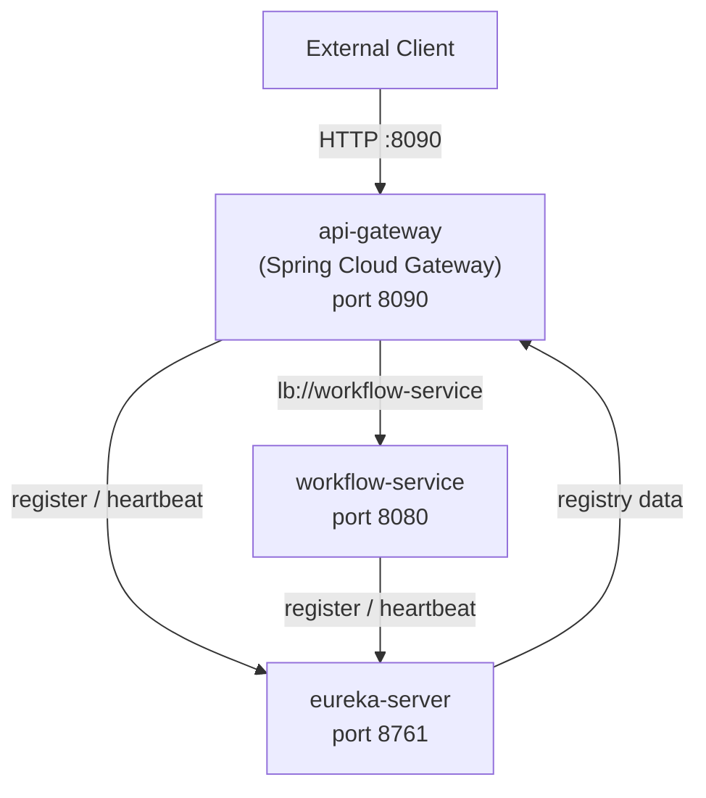

# Design Document: API Gateway (Phase 2)

## Overview

Phase 2 introduces two new standalone Spring Boot services and updates the existing `workflow-service` to participate in service discovery. The architecture follows the standard Spring Cloud pattern: a Eureka Server acts as the service registry, all microservices register as Eureka clients, and the Spring Cloud Gateway resolves downstream routes via load-balanced URIs backed by the registry.

No business logic changes are made in this phase. The focus is entirely on infrastructure: discovery, routing, and resilience at the network layer.

**Startup order for local development:**
1. `eureka-server` (port 8761)
2. `workflow-service` (port 8080) — registers with Eureka
3. `api-gateway` (port 8090) — registers with Eureka, resolves routes

Each service is independently startable; missing Eureka at startup produces a warning log, not a crash.

---

## Architecture



### Component Responsibilities

| Component | Role |
|-----------|------|
| `eureka-server` | Service registry — accepts registrations, tracks heartbeats, evicts stale instances |
| `api-gateway` | Single entry point — resolves `lb://` URIs via Eureka, forwards requests, returns responses |
| `workflow-service` | Downstream service — registers with Eureka, handles business logic |

### Spring Cloud Version Strategy

All Spring Cloud components use the **2023.0.x** (Leyton) release train, which is compatible with Spring Boot 3.2.x. The BOM is imported in each service's `pom.xml` to ensure consistent dependency versions across `spring-cloud-gateway`, `spring-cloud-netflix-eureka-server`, `spring-cloud-starter-netflix-eureka-client`, and `spring-cloud-starter-loadbalancer`.

---

## Components and Interfaces

### 1. `eureka-server` (`services/eureka-server`)

**Package:** `com.aiworkflow.eureka`

```
services/eureka-server/
├── pom.xml
└── src/main/
    ├── java/com/aiworkflow/eureka/
    │   └── EurekaServerApplication.java   # @SpringBootApplication + @EnableEurekaServer
    └── resources/
        └── application.yml
```

**Key annotation:** `@EnableEurekaServer` on the main application class.

**`application.yml`:**
```yaml
server:
  port: 8761

spring:
  application:
    name: eureka-server

eureka:
  instance:
    hostname: localhost
  client:
    registerWithEureka: false
    fetchRegistry: false
    serviceUrl:
      defaultZone: http://${eureka.instance.hostname}:${server.port}/eureka/

management:
  endpoints:
    web:
      exposure:
        include: health
  endpoint:
    health:
      show-details: always
```

**`pom.xml` key dependencies:**
- `spring-boot-starter-parent` 3.2.5
- `spring-cloud-dependencies` BOM (2023.0.x)
- `spring-cloud-starter-netflix-eureka-server`
- `spring-boot-starter-actuator`

---

### 2. `api-gateway` (`services/api-gateway`)

**Package:** `com.aiworkflow.gateway`

```
services/api-gateway/
├── pom.xml
└── src/main/
    ├── java/com/aiworkflow/gateway/
    │   └── ApiGatewayApplication.java     # @SpringBootApplication only
    └── resources/
        └── application.yml
```

No Java DSL route configuration — all routes are declared in `application.yml`.

**`application.yml`:**
```yaml
server:
  port: 8090

spring:
  application:
    name: api-gateway
  cloud:
    gateway:
      routes:
        - id: workflow-service
          uri: lb://workflow-service
          predicates:
            - Path=/api/workflows/**

eureka:
  client:
    serviceUrl:
      defaultZone: http://localhost:8761/eureka/
  instance:
    preferIpAddress: false

management:
  endpoints:
    web:
      exposure:
        include: health
  endpoint:
    health:
      show-details: always
```

**`pom.xml` key dependencies:**
- `spring-boot-starter-parent` 3.2.5
- `spring-cloud-dependencies` BOM (2023.0.x)
- `spring-cloud-starter-gateway` (reactive WebFlux-based)
- `spring-cloud-starter-netflix-eureka-client`
- `spring-cloud-starter-loadbalancer`
- `spring-boot-starter-actuator`

> Note: `spring-boot-starter-web` must NOT be included — Spring Cloud Gateway requires the reactive stack (`spring-boot-starter-webflux` is pulled in transitively by `spring-cloud-starter-gateway`).

---

### 3. `workflow-service` Eureka Client Update

The existing `workflow-service` `pom.xml` and `application.yml` are updated to add Eureka client support. No Java source changes are required.

**`pom.xml` additions:**
```xml
<dependency>
    <groupId>org.springframework.cloud</groupId>
    <artifactId>spring-cloud-starter-netflix-eureka-client</artifactId>
</dependency>
```

Plus the Spring Cloud BOM import in `<dependencyManagement>`.

**`application.yml` additions:**
```yaml
spring:
  application:
    name: workflow-service

eureka:
  client:
    serviceUrl:
      defaultZone: http://localhost:8761/eureka/
  instance:
    instanceId: ${spring.application.name}:${server.port}
    preferIpAddress: false
```

The `spring.application.name=workflow-service` value becomes the service name used in the Eureka registry and in the gateway's `lb://workflow-service` URI.

---

## Data Models

### Eureka Registration Metadata

Eureka client registration is handled entirely by the Spring Cloud Netflix library. The relevant metadata exposed per instance:

| Field | Value | Source |
|-------|-------|--------|
| `appName` | `workflow-service` | `spring.application.name` |
| `instanceId` | `workflow-service:8080` | `eureka.instance.instanceId` |
| `port` | `8080` | `server.port` |
| `status` | `UP` / `DOWN` / `OUT_OF_SERVICE` | Eureka heartbeat state |
| `homePageUrl` | `http://localhost:8080/` | auto-derived |
| `healthCheckUrl` | `http://localhost:8080/actuator/health` | auto-derived |

### Gateway Route Configuration Model

Routes are pure YAML configuration — no Java model classes. Each route entry has:

| Field | Type | Description |
|-------|------|-------------|
| `id` | String | Unique route identifier |
| `uri` | String | Target URI — `lb://` prefix triggers load-balanced resolution |
| `predicates` | List | Matching rules — `Path` predicate used in Phase 2 |
| `filters` | List | Request/response transformations — none in Phase 2 |

### Health Response Shape

Spring Boot Actuator `/actuator/health` response (with `show-details: always`):

```json
{
  "status": "UP",
  "components": {
    "discoveryComposite": {
      "status": "UP",
      "components": {
        "discoveryClient": { "status": "UP" },
        "eureka": { "status": "UP" }
      }
    },
    "diskSpace": { "status": "UP" },
    "ping": { "status": "UP" }
  }
}
```

---

## Correctness Properties

*A property is a characteristic or behavior that should hold true across all valid executions of a system — essentially, a formal statement about what the system should do. Properties serve as the bridge between human-readable specifications and machine-verifiable correctness guarantees.*

This phase is primarily infrastructure configuration. Most acceptance criteria are verified by concrete integration examples (start the service, hit the endpoint, check the result). However, three universal properties emerge from the routing and registration requirements.

---

Property 1: Any matching path is routed and path is preserved
*For any* request path of the form `/api/workflows/<suffix>` (where suffix is any non-empty string), the Gateway SHALL forward the request to a `workflow-service` instance AND the forwarded path SHALL equal the original path — no prefix is stripped or rewritten.
**Validates: Requirements 3.1, 3.2**

---

Property 2: Response passthrough is transparent
*For any* HTTP response returned by the Workflow_Service (any status code 1xx–5xx, any body content, any headers), the Gateway SHALL return that exact status code and body to the original caller without modification.
**Validates: Requirements 3.3, 3.5**

---

Property 3: Registration round trip
*For any* service instance that successfully registers with the Eureka_Server, querying the Eureka_Server's registry SHALL return an entry containing that instance's `appName`, `instanceId`, and `port`.
**Validates: Requirements 1.4, 4.1, 4.6**

---

## Routing Constraints

- The Gateway SHALL NOT use any `StripPrefix`, `RewritePath`, or similar path-mutation filters in Phase 2. The incoming request path MUST be forwarded to the downstream service unchanged.
- No custom header filtering or mutation is applied in Phase 2. The Gateway forwards all incoming request headers to downstream services by default.
- The Gateway uses default timeout and retry configuration from Spring Cloud Gateway. No custom timeout or retry policies are defined in Phase 2.
- When multiple instances of `workflow-service` are registered, the Gateway SHALL distribute requests using Spring Cloud LoadBalancer (round-robin by default).
- Services MAY be started in any order. A missing dependency (e.g. Eureka unavailable) SHALL result in WARN-level log output, not a startup failure.
- Gateway health is considered `UP` even if no downstream service instances are currently registered, as long as the Eureka discovery client itself is functional.
- All service names MUST match `spring.application.name` exactly and be used consistently in `lb://` URIs (e.g. `lb://workflow-service` matches `spring.application.name=workflow-service`).

---

## Error Handling

### Gateway — No Downstream Instance (503)

When Spring Cloud LoadBalancer cannot resolve `lb://workflow-service` (no instances registered or all instances are DOWN), Spring Cloud Gateway returns HTTP 503 automatically. No custom error handling code is required in Phase 2.

### Gateway — Eureka Unavailable at Startup

Spring Cloud Netflix Eureka client is configured with `eureka.client.enabled=true` and `spring.cloud.discovery.enabled=true` by default. If Eureka is unreachable at startup, the client logs a WARN and retries on a background thread. The gateway application context starts successfully. This behavior is provided by the library — no custom code needed.

### Workflow Service — Eureka Unavailable at Startup

Same behavior as the gateway: the Eureka client retries registration in the background. The workflow service continues to serve requests normally. Existing Phase 1 error handling is unaffected.

### Downstream Error Propagation

Spring Cloud Gateway passes 4xx and 5xx responses from downstream services through to the caller unchanged. No custom `GlobalExceptionHandler` is needed in the gateway for Phase 2.

---

## Testing Strategy

### Approach

Gateway and Eureka infrastructure components are not amenable to traditional unit testing (there is no business logic to mock). The testing strategy uses two layers:

1. **Integration tests** — Spring Boot Test with `@SpringBootTest(webEnvironment = RANDOM_PORT)` to verify startup, health endpoints, and configuration correctness.
2. **Property-based tests** — jqwik to verify the universal routing and passthrough properties using a mock downstream server (WireMock).

### Test Layers

| Layer | Tool | Scope |
|-------|------|-------|
| Eureka Server integration | Spring Boot Test | Startup, health endpoint, self-registration exclusion |
| Gateway integration | Spring Boot Test + WireMock | Route matching, path preservation, response passthrough, 503 on no instances |
| Workflow Service Eureka | Spring Boot Test + Testcontainers (PostgreSQL) | Eureka client config, registration metadata |
| Property-based (routing) | jqwik + WireMock | Properties 1, 2, 3 — minimum 100 iterations each |

### Property-Based Test Configuration

Each property test uses jqwik with a minimum of 100 tries. WireMock stubs the downstream `workflow-service` to return generated responses. The gateway is started with a mock Eureka registry that returns a single `workflow-service` instance pointing at the WireMock server.

Tag format for each property test:
- **Feature: api-gateway, Property 1: Any matching path is routed and path is preserved**
- **Feature: api-gateway, Property 2: Response passthrough is transparent**
- **Feature: api-gateway, Property 3: Registration round trip**

### Logging Expectations

- Eureka clients (gateway and workflow-service) log registration and heartbeat events at INFO level via SLF4J + Logback.
- Gateway logs route resolution and forwarding decisions at INFO level.
- Startup warnings when Eureka is unavailable are logged at WARN level.

### What Is NOT Tested

- Heartbeat timing and eviction (time-dependent, covered by Eureka library's own tests)
- Logging output (not a meaningful automated assertion)
- Build packaging (`mvn package` — verified by CI, not a JUnit test)
- Ribbon vs LoadBalancer selection (dependency configuration, not runtime behavior)

### Integration Test Examples

**Eureka Server health:**
```java
@SpringBootTest(webEnvironment = SpringBootTest.WebEnvironment.DEFINED_PORT)
class EurekaServerHealthTest {
    @Test
    void healthEndpointReturnsUp() {
        // GET http://localhost:8761/actuator/health → 200, status=UP
    }

    @Test
    void eurekaServerDoesNotRegisterItself() {
        // GET http://localhost:8761/eureka/apps/EUREKA-SERVER → 404
    }
}
```

**Gateway routing:**
```java
@SpringBootTest(webEnvironment = SpringBootTest.WebEnvironment.RANDOM_PORT)
class GatewayRoutingTest {
    // WireMock stub for workflow-service
    // Mock Eureka registry returning WireMock instance

    @Test
    void workflowPathIsForwardedToWorkflowService() { ... }

    @Test
    void noInstancesRegisteredReturns503() { ... }

    @Test
    void healthEndpointIncludesDiscoveryComposite() { ... }
}
```

**Property test skeleton:**
```java
@Property(tries = 100)
// Feature: api-gateway, Property 1: Any matching path is routed and path is preserved
void anyWorkflowPathIsRoutedAndPreserved(@ForAll @StringLength(min = 1) String suffix) {
    // arrange: WireMock stub captures forwarded path
    // act: GET /api/workflows/{suffix} via gateway
    // assert: WireMock received request at /api/workflows/{suffix}
}

@Property(tries = 100)
// Feature: api-gateway, Property 2: Response passthrough is transparent
void gatewayPassesThroughAnyStatusCodeAndBody(
        @ForAll @IntRange(min = 200, max = 599) int statusCode,
        @ForAll String body) {
    // arrange: WireMock returns statusCode + body
    // act: GET /api/workflows/test via gateway
    // assert: caller receives same statusCode and body
}
```
