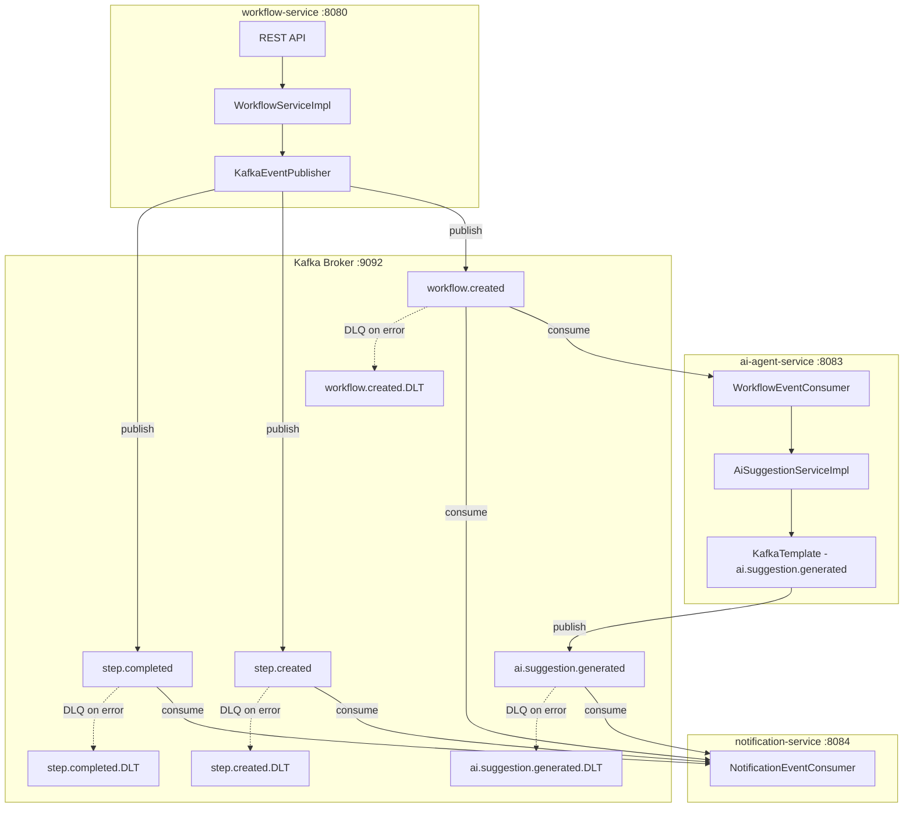

# Design Document: kafka-event-driven (Phase 5)

## Overview

Phase 5 replaces the SLF4J stub event publisher in `workflow-service` with a real Apache Kafka producer, implements the stubbed `WorkflowEventConsumer` in `ai-agent-service`, and introduces a new `notification-service` that consumes all domain events. A Docker Compose file provides the local Kafka + Zookeeper infrastructure. All services continue to register with Eureka and are accessible via the API Gateway.

The design follows the existing platform conventions: each service owns its own event POJO copies (no shared JAR), Kafka failures are isolated from primary business operations, and all consumers are idempotent under at-least-once delivery semantics.

---

## Architecture



### Event Flow Summary

| Event | Producer | Consumers | Key |
|-------|----------|-----------|-----|
| `workflow.created` | `workflow-service` | `ai-agent-service`, `notification-service` | `workflowId` |
| `step.created` | `workflow-service` | `notification-service` | `workflowId` |
| `step.completed` | `workflow-service` | `notification-service` | `workflowId` |
| `ai.suggestion.generated` | `ai-agent-service` | `notification-service` | `workflowId` |

---

## Components and Interfaces

### workflow-service Changes

#### KafkaEventPublisher

Replaces `StubEventPublisher` as the active `EventPublisher` bean. Uses `KafkaTemplate<String, Object>` to publish JSON-serialized event POJOs. The `workflowId` (as a string) is used as the Kafka message key on every send.

```java
@Component
@ConditionalOnProperty(name = "kafka.enabled", havingValue = "true", matchIfMissing = true)
public class KafkaEventPublisher implements EventPublisher {
    private final KafkaTemplate<String, Object> kafkaTemplate;

    public void publishWorkflowCreated(UUID workflowId, String workflowName) {
        // sends WorkflowCreatedEvent to "workflow.created" with key=workflowId.toString()
    }
    public void publishStepCreated(UUID workflowId, UUID stepId, String stepName) {
        // sends StepCreatedEvent to "step.created" with key=workflowId.toString()
    }
    public void publishStepCompleted(UUID workflowId, UUID stepId) {
        // sends StepCompletedEvent to "step.completed" with key=workflowId.toString()
    }
}
```

`StubEventPublisher` is retained but annotated with `@ConditionalOnProperty(name = "kafka.enabled", havingValue = "false")` so it can be activated in tests without a real broker.

#### KafkaProducerConfig

```java
@Configuration
public class KafkaProducerConfig {
    @Bean
    public ProducerFactory<String, Object> producerFactory(KafkaProperties props) {
        // JsonSerializer for values, StringSerializer for keys
        // acks=all, retries=3
    }

    @Bean
    public KafkaTemplate<String, Object> kafkaTemplate(ProducerFactory<String, Object> pf) { ... }
}
```

### ai-agent-service Changes

#### WorkflowEventConsumer (implement existing stub)

```java
@Component
public class WorkflowEventConsumer {
    private final AiSuggestionService aiSuggestionService;
    private final KafkaTemplate<String, Object> kafkaTemplate;

    @KafkaListener(topics = "workflow.created", groupId = "ai-agent-service")
    public void onWorkflowCreated(WorkflowCreatedEvent event) {
        // 1. call aiSuggestionService.suggest(...)
        // 2. publish AiSuggestionGeneratedEvent to "ai.suggestion.generated"
        // 3. on exception: log ERROR, do not rethrow
    }
}
```

#### KafkaConsumerConfig (ai-agent-service)

```java
@Configuration
public class KafkaConsumerConfig {
    // JsonDeserializer for WorkflowCreatedEvent
    // auto-offset-reset=earliest
    // DeadLetterPublishingRecoverer for deserialization errors → workflow.created.DLT
}
```

### notification-service (new service)

#### NotificationEventConsumer

```java
@Component
public class NotificationEventConsumer {
    @KafkaListener(topics = {"workflow.created", "step.created", "step.completed", "ai.suggestion.generated"},
                   groupId = "notification-service")
    public void onEvent(ConsumerRecord<String, String> record) {
        // deserialize based on topic name, log at INFO
    }
}
```

The `notification-service` uses a `String` value deserializer and performs manual JSON parsing per topic, which avoids class-cast issues when consuming from multiple topics with different schemas.

#### NotificationServiceApplication

```java
@SpringBootApplication
@EnableDiscoveryClient
public class NotificationServiceApplication {
    public static void main(String[] args) {
        SpringApplication.run(NotificationServiceApplication.class, args);
    }
}
```

---

## Data Models

### Event POJOs

Each service defines its own local copies of the event records it needs. There is no shared library — this avoids tight coupling between services.

#### workflow-service — `event/` package

```java
public record WorkflowCreatedEvent(UUID workflowId, String workflowName) {}
public record StepCreatedEvent(UUID workflowId, UUID stepId, String stepName) {}
public record StepCompletedEvent(UUID workflowId, UUID stepId) {}
```

#### ai-agent-service — `kafka/` package

```java
public record WorkflowCreatedEvent(UUID workflowId, String workflowName) {}  // for deserialization
public record AiSuggestionGeneratedEvent(UUID workflowId, String suggestion) {}  // for serialization
```

#### notification-service — `event/` package

```java
public record WorkflowCreatedEvent(UUID workflowId, String workflowName) {}
public record StepCreatedEvent(UUID workflowId, UUID stepId, String stepName) {}
public record StepCompletedEvent(UUID workflowId, UUID stepId) {}
public record AiSuggestionGeneratedEvent(UUID workflowId, String suggestion) {}
```

### Kafka Topic Configuration

| Topic | Partitions | Replication Factor | Key Type | Value Type |
|-------|------------|-------------------|----------|------------|
| `workflow.created` | 3 | 1 (local dev) | `String` (workflowId) | JSON |
| `step.created` | 3 | 1 (local dev) | `String` (workflowId) | JSON |
| `step.completed` | 3 | 1 (local dev) | `String` (workflowId) | JSON |
| `ai.suggestion.generated` | 3 | 1 (local dev) | `String` (workflowId) | JSON |

### Docker Compose Infrastructure

```yaml
# infra/docker/docker-compose.yml (relevant Kafka section)
services:
  zookeeper:
    image: confluentinc/cp-zookeeper:7.6.0
    environment:
      ZOOKEEPER_CLIENT_PORT: 2181

  kafka:
    image: confluentinc/cp-kafka:7.6.0
    depends_on: [zookeeper]
    ports:
      - "9092:9092"
    environment:
      KAFKA_BROKER_ID: 1
      KAFKA_ZOOKEEPER_CONNECT: zookeeper:2181
      KAFKA_ADVERTISED_LISTENERS: PLAINTEXT://localhost:9092
      KAFKA_AUTO_CREATE_TOPICS_ENABLE: "true"
```

---

## Correctness Properties

A property is a characteristic or behavior that should hold true across all valid executions of a system — essentially, a formal statement about what the system should do. Properties serve as the bridge between human-readable specifications and machine-verifiable correctness guarantees.

### Property 1: Event serialization round-trip

*For any* valid event record (`WorkflowCreatedEvent`, `StepCreatedEvent`, `StepCompletedEvent`, or `AiSuggestionGeneratedEvent`), serializing it to JSON and then deserializing it back should produce an object equal to the original.

**Validates: Requirements 2.5, 5.4, 5.5, 5.6, 5.7, 8.2**

---

### Property 2: Producer failure does not propagate to caller

*For any* call to `KafkaEventPublisher.publishWorkflowCreated`, `publishStepCreated`, or `publishStepCompleted` where the underlying `KafkaTemplate.send` throws an exception, the method should return normally (no exception propagated) and the error should be logged.

**Validates: Requirements 2.6, 7.1**

---

### Property 3: Consumer idempotency

*For any* `WorkflowCreatedEvent`, processing it once or processing it multiple times through `WorkflowEventConsumer.onWorkflowCreated` should produce the same observable outcome — specifically, `AiSuggestionService.suggest` is called with the same arguments each time and the result is published.

**Validates: Requirements 3.2, 3.3, 7.6**

---

### Property 4: Consumer exception isolation

*For any* invocation of `WorkflowEventConsumer.onWorkflowCreated` where `AiSuggestionService.suggest` throws an exception, the consumer method should return normally without re-throwing, so that the Kafka offset is committed.

**Validates: Requirements 3.4, 7.2**

---

### Property 5: Notification log format completeness

*For any* `WorkflowCreatedEvent` with arbitrary `workflowId` and `workflowName`, the log output produced by `NotificationEventConsumer` should contain both the `workflowId` string and the `workflowName` string.

**Validates: Requirements 4.5, 4.6, 4.7, 4.8**

---

### Property 6: Null fields serialize as JSON null

*For any* event record where an optional field is `null`, the JSON serialization should include the field key with a `null` value rather than omitting the key entirely.

**Validates: Requirements 5.8**

---

### Property 7: Message key equals workflowId

*For any* event published by `KafkaEventPublisher`, the Kafka message key should equal the `workflowId` of that event serialized as a string.

**Validates: Requirements 7.7, 8.1**

---

## Error Handling

### Producer Error Handling

`KafkaEventPublisher` wraps every `kafkaTemplate.send()` call in a try-catch. On exception:
- Log at `ERROR` level: `event.publish.failed topic={} eventType={} workflowId={}`
- Return normally — the primary DB transaction is unaffected.

`KafkaTemplate.send()` returns a `CompletableFuture`; the publisher attaches a callback via `.whenComplete()` to catch async send failures without blocking the calling thread.

### Consumer Error Handling

Both `WorkflowEventConsumer` and `NotificationEventConsumer` use Spring Kafka's `DefaultErrorHandler` configured with a `DeadLetterPublishingRecoverer`. After 0 retries (immediate DLT routing for deserialization errors) or 3 retries (for processing errors), the message is forwarded to `<topic>.DLT`.

```java
@Bean
public DefaultErrorHandler errorHandler(KafkaTemplate<Object, Object> template) {
    DeadLetterPublishingRecoverer recoverer = new DeadLetterPublishingRecoverer(template);
    return new DefaultErrorHandler(recoverer, new FixedBackOff(1000L, 3));
}
```

For deserialization errors specifically, `ErrorHandlingDeserializer` wraps the `JsonDeserializer` and routes failures directly to the DLT without retrying.

### Startup Resilience

Spring Kafka's `KafkaTemplate` does not block application startup if the broker is unreachable. The `spring.kafka.producer.retries` and connection timeout settings ensure that individual send attempts fail fast and are caught by the error handler rather than hanging the application thread.

---

## Testing Strategy

### Dual Testing Approach

Both unit tests and property-based tests are required. Unit tests cover specific examples, integration points, and error conditions. Property-based tests (jqwik) verify universal correctness properties across generated inputs.

### Unit Tests

| Component | Test Class | Scope |
|-----------|-----------|-------|
| `KafkaEventPublisher` | `KafkaEventPublisherTest` | Verify `KafkaTemplate.send` called with correct topic, key, and payload; verify exception swallowing |
| `WorkflowEventConsumer` | `WorkflowEventConsumerTest` | Verify `AiSuggestionService.suggest` called on event receipt; verify exception isolation |
| `NotificationEventConsumer` | `NotificationEventConsumerTest` | Verify correct log output per event type |
| `WorkflowServiceImpl` (updated) | Existing tests remain valid | No change to business logic |

### Property-Based Tests (jqwik)

Each property below maps to a correctness property in the design. Minimum 100 iterations per property.

| Property | Test Class | jqwik Tag |
|----------|-----------|-----------|
| Property 1: Event serialization round-trip | `EventSerializationPropertyTest` | `Feature: kafka-event-driven, Property 1: Event serialization round-trip` |
| Property 2: Producer failure does not propagate | `KafkaEventPublisherPropertyTest` | `Feature: kafka-event-driven, Property 2: Producer failure does not propagate to caller` |
| Property 3: Consumer idempotency | `WorkflowEventConsumerPropertyTest` | `Feature: kafka-event-driven, Property 3: Consumer idempotency` |
| Property 4: Consumer exception isolation | `WorkflowEventConsumerPropertyTest` | `Feature: kafka-event-driven, Property 4: Consumer exception isolation` |
| Property 5: Notification log format completeness | `NotificationEventConsumerPropertyTest` | `Feature: kafka-event-driven, Property 5: Notification log format completeness` |
| Property 6: Null fields serialize as JSON null | `EventSerializationPropertyTest` | `Feature: kafka-event-driven, Property 6: Null fields serialize as JSON null` |
| Property 7: Message key equals workflowId | `KafkaEventPublisherPropertyTest` | `Feature: kafka-event-driven, Property 7: Message key equals workflowId` |

### Integration Tests

- `KafkaIntegrationTest` in each service uses `@EmbeddedKafka` (from `spring-kafka-test`) to spin up an in-process Kafka broker.
- Tests verify end-to-end: REST call → Kafka publish → consumer receives → correct log/action.
- Integration tests are placed in `integration/` and excluded from the default Surefire run (consistent with existing services).

### Test Dependencies

Add to each service's `pom.xml` (test scope):
```xml
<dependency>
    <groupId>org.springframework.kafka</groupId>
    <artifactId>spring-kafka-test</artifactId>
    <scope>test</scope>
</dependency>
<dependency>
    <groupId>org.testcontainers</groupId>
    <artifactId>kafka</artifactId>
    <scope>test</scope>
</dependency>
```
