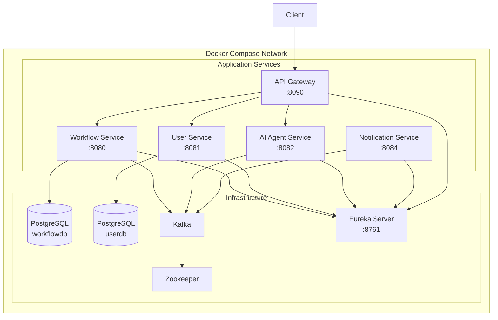
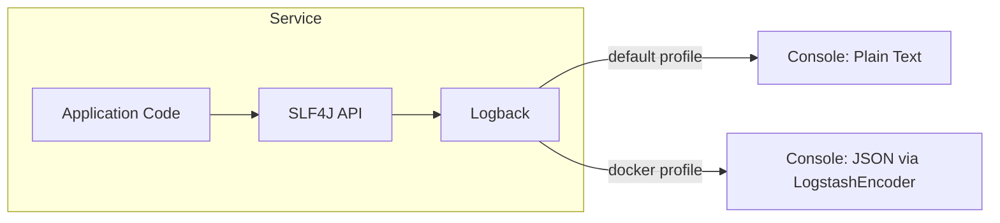

# Design Document: Production Readiness

## Overview

This design covers four workstreams for Phase 7: Dockerfiles for all six services, an updated Docker Compose configuration, structured JSON logging, and a comprehensive README. All changes are operational — no business logic is modified.

The platform consists of six Spring Boot 3.2.5 / Java 17 services:
- **workflow-service** (port 8080) — PostgreSQL + Flyway + Kafka producer
- **user-service** (port 8081) — PostgreSQL + Flyway + JWT auth
- **ai-agent-service** (port 8082) — stateless, Kafka consumer/producer
- **notification-service** (port 8084) — stateless, Kafka consumer
- **eureka-server** (port 8761) — service registry
- **api-gateway** (port 8090) — Spring Cloud Gateway, reactive stack

## Architecture

### System Architecture (Docker Compose)



### Dockerfile Architecture (Multi-Stage Build)

Each service uses an identical two-stage Dockerfile pattern:

```
Stage 1: Build (maven:3.9-eclipse-temurin-17)
  ├── Copy pom.xml → mvn dependency:go-offline (layer cache)
  ├── Copy src/ → mvn package -DskipTests
  └── Output: target/*.jar

Stage 2: Runtime (eclipse-temurin:17-jre-alpine)
  ├── Create non-root user (appuser)
  ├── Copy JAR from Stage 1
  ├── EXPOSE <port>
  └── ENTRYPOINT ["java", "-jar", "app.jar"]
```

### Logging Architecture



## Components and Interfaces

### 1. Dockerfiles

Six identical Dockerfiles, one per service directory. Each follows the same template with only the `EXPOSE` port varying.

| Service | Dockerfile Location | Exposed Port |
|---------|-------------------|-------------|
| workflow-service | `services/workflow-service/Dockerfile` | 8080 |
| user-service | `services/user-service/Dockerfile` | 8081 |
| ai-agent-service | `services/ai-agent-service/Dockerfile` | 8082 |
| notification-service | `services/notification-service/Dockerfile` | 8084 |
| eureka-server | `services/eureka-server/Dockerfile` | 8761 |
| api-gateway | `services/api-gateway/Dockerfile` | 8090 |

**Dockerfile Template (pseudocode):**

```dockerfile
# Stage 1: Build
FROM maven:3.9-eclipse-temurin-17 AS build
WORKDIR /app
COPY pom.xml .
RUN mvn dependency:go-offline -B
COPY src ./src
RUN mvn package -DskipTests -B

# Stage 2: Runtime
FROM eclipse-temurin:17-jre-alpine
RUN addgroup -S appgroup && adduser -S appuser -G appgroup
WORKDIR /app
COPY --from=build /app/target/*.jar app.jar
RUN chown appuser:appgroup app.jar
USER appuser
EXPOSE <PORT>
ENTRYPOINT ["java", "-jar", "app.jar"]
```

### 2. Docker Compose Configuration

**File:** `infra/docker/docker-compose.yml`

**Key changes from current state:**
- Replace all `image:` directives with `build:` context pointing to service directories
- Add two PostgreSQL service definitions with named volumes
- Add health checks for PostgreSQL, Kafka, Eureka
- Add `depends_on` with `condition: service_healthy`
- Add `restart: unless-stopped` to all services
- Add custom bridge network `aiworkflow-net`
- Pass correct environment variables for inter-container connectivity

**Service dependency graph:**

```
zookeeper → kafka → (workflow-service, ai-agent-service, notification-service)
postgres-workflow → workflow-service
postgres-user → user-service
eureka-server → (api-gateway, workflow-service, user-service, ai-agent-service, notification-service)
```

**PostgreSQL services:**

| Container | Database | Port | Volume |
|-----------|----------|------|--------|
| postgres-workflow | workflowdb | 5432 (internal only) | pgdata-workflow |
| postgres-user | userdb | 5433:5432 | pgdata-user |

Both use `postgres:16-alpine` image. The workflow DB is not exposed to the host (services connect internally). The user DB is mapped to 5433 to avoid port conflicts.

**Health checks:**

| Service | Health Check | Interval | Retries |
|---------|-------------|----------|---------|
| postgres-workflow | `pg_isready -U postgres -d workflowdb` | 5s | 5 |
| postgres-user | `pg_isready -U postgres -d userdb` | 5s | 5 |
| eureka-server | `wget --spider http://localhost:8761/actuator/health` | 10s | 10 |
| kafka | `kafka-broker-api-versions --bootstrap-server localhost:9092` | 10s | 10 |

### 3. Logback Configuration

**Files:** `src/main/resources/logback-spring.xml` in each service.

**Dependency:** `net.logstash.logback:logstash-logback-encoder:7.4` added to each `pom.xml`.

**Profile-based switching:**
- Default (no profile / local dev): `ConsoleAppender` with `PatternLayout` — human-readable
- `docker` profile: `ConsoleAppender` with `LogstashEncoder` — structured JSON

**Plain-text pattern:**
```
%d{yyyy-MM-dd HH:mm:ss.SSS} [%thread] %-5level %logger{36} - %msg%n
```

**JSON fields (LogstashEncoder defaults + custom):**
- `@timestamp` — ISO-8601 timestamp
- `level` — log level
- `logger_name` — logger class
- `message` — log message
- `thread_name` — thread
- `service_name` — from `spring.application.name` (custom field)
- `stack_trace` — present only when exception is logged

**Configurable log level:**
The root log level reads from `LOG_LEVEL` environment variable, defaulting to `INFO`:
```xml
<root level="${LOG_LEVEL:-INFO}">
```

### 4. README Documentation

**File:** `README.md` (root of repository)

**Sections:**

1. **Title and badges** — project name
2. **Architecture Overview** — Mermaid diagram (same as design doc)
3. **Services** — table with name, description, port, stack
4. **Prerequisites** — Java 17, Maven 3.8+, Docker Desktop, PostgreSQL (for local dev)
5. **Quick Start: Local Development** — step-by-step without Docker
6. **Quick Start: Docker Compose** — single-command startup
7. **API Endpoints** — tables per service with method, path, description
8. **Event Model** — Kafka topics table with producer, consumer, payload
9. **Environment Variables** — full reference table
10. **Project Structure** — directory tree overview

## Data Models

This phase does not introduce new data models. The existing domain models (Workflow, Step, User) are unchanged.

**Configuration artifacts produced:**

| Artifact | Type | Location |
|----------|------|----------|
| Dockerfile | Docker build file | `services/<service>/Dockerfile` (×6) |
| docker-compose.yml | Docker Compose config | `infra/docker/docker-compose.yml` |
| logback-spring.xml | Logback config | `services/<service>/src/main/resources/logback-spring.xml` (×6) |
| README.md | Documentation | `README.md` |
| pom.xml (modified) | Maven config | `services/<service>/pom.xml` (×6, add logstash-logback-encoder) |


## Correctness Properties

*A property is a characteristic or behavior that should hold true across all valid executions of a system — essentially, a formal statement about what the system should do. Properties serve as the bridge between human-readable specifications and machine-verifiable correctness guarantees.*

The following properties are derived from the acceptance criteria. Since this phase is primarily about configuration files (Dockerfiles, YAML, XML) rather than application logic, most properties validate structural correctness of generated artifacts across all six services.

### Property 1: Dockerfile security and port correctness

*For any* service in the platform, the service's Dockerfile SHALL specify a non-root USER directive AND the EXPOSE port SHALL match the service's configured `server.port` from `application.yml`.

**Validates: Requirements 1.4, 1.5**

Reasoning: Requirements 1.4 and 1.5 both apply to every Dockerfile. Rather than checking them separately, we combine into one property: for all services, the Dockerfile is both secure (non-root) and correctly configured (right port). We parse each Dockerfile and cross-reference against the known port mapping.

### Property 2: Docker Compose uses build context for all services

*For any* application service defined in `docker-compose.yml`, the service definition SHALL contain a `build` key with a valid context path and SHALL NOT contain an `image` key.

**Validates: Requirements 2.1**

Reasoning: Requirement 2.1 states all services must build from source. We parse the compose file and verify that every service entry uses `build` instead of `image`. This is a universal property over all service definitions.

### Property 3: Docker Compose dependency wiring

*For any* application service in `docker-compose.yml`, the service SHALL have `depends_on` entries with `condition: service_healthy` for its infrastructure dependencies, AND environment variables SHALL reference container hostnames (not `localhost`).

**Validates: Requirements 2.4, 2.5**

Reasoning: Requirements 2.4 and 2.5 both ensure services are correctly wired to their dependencies. We combine them: for all application services, dependencies use health conditions and env vars point to container names.

### Property 4: Docker Compose service runtime configuration

*For any* service in `docker-compose.yml`, the service SHALL expose the correct host port matching its configured server port AND SHALL have `restart: unless-stopped` configured.

**Validates: Requirements 2.6, 2.8**

Reasoning: Requirements 2.6 and 2.8 both apply to every service's runtime configuration. We combine: for all services, ports are correct and restart policy is set.

### Property 5: Logging dependency present in all services

*For any* service in the platform, the service's `pom.xml` SHALL contain a dependency on `logstash-logback-encoder`.

**Validates: Requirements 3.1**

Reasoning: Requirement 3.1 applies to all six services. We parse each pom.xml and verify the dependency is present.

### Property 6: Logback configuration completeness

*For any* service in the platform, the service SHALL have a `logback-spring.xml` file that contains: a default-profile appender using `PatternLayout` for plain text, a docker-profile appender using `LogstashEncoder` for JSON, and a root log level configured via `${LOG_LEVEL:-INFO}`.

**Validates: Requirements 3.2, 3.3, 3.4, 3.7**

Reasoning: Requirements 3.2, 3.3, 3.4, and 3.7 all describe aspects of the same logback-spring.xml file. Rather than four separate properties, we combine into one comprehensive check: for all services, the logback config has both profile appenders and the configurable log level.

### Property 7: Structured JSON log output contains required fields

*For any* log message produced with the docker profile active, the JSON output SHALL contain the fields: `@timestamp`, `level`, `logger_name`, `message`, `service_name`, and `thread_name`. When an exception is logged, the JSON output SHALL additionally contain `stack_trace`.

**Validates: Requirements 3.5, 3.6**

Reasoning: This is the only runtime property. We configure LogstashEncoder programmatically, log messages (with and without exceptions), and verify the JSON output contains all required fields. The exception case (3.6) is an edge case of the same property.

### Property 8: README documents all API endpoints

*For any* REST endpoint defined in the codebase (across workflow-service, user-service, and ai-agent-service), the README SHALL contain a corresponding entry with the HTTP method and path.

**Validates: Requirements 4.6**

Reasoning: The README must be complete. We can enumerate all `@GetMapping`, `@PostMapping`, etc. annotations in the codebase and verify each appears in the README.

### Property 9: README documents all Kafka topics

*For any* Kafka topic used in the platform (`workflow.created`, `step.created`, `step.completed`, `ai.suggestion.generated`), the README SHALL contain a corresponding entry documenting the topic.

**Validates: Requirements 4.7**

Reasoning: Similar to Property 8, we verify completeness of event documentation against the known topic list.

## Error Handling

This phase does not introduce new error-handling logic. Existing error handling in all services remains unchanged.

**Docker-specific considerations:**
- Dockerfiles use `ENTRYPOINT` (not `CMD`) so the JVM receives signals correctly for graceful shutdown
- Docker Compose health checks have retries and intervals to handle slow infrastructure startup
- `restart: unless-stopped` ensures services recover from transient failures
- `depends_on` with health conditions prevents services from starting before their dependencies are ready

**Logging considerations:**
- If `LOG_LEVEL` environment variable is not set, Logback defaults to `INFO` — no error
- If the `docker` profile is not active, plain-text logging is used — no error
- LogstashEncoder handles exceptions by including `stack_trace` in JSON output

## Testing Strategy

### Dual Testing Approach

This phase is primarily configuration and documentation, so testing focuses on validating the correctness of generated artifacts rather than application logic.

**Unit tests:** Verify specific examples and edge cases
- Dockerfile exists in each expected directory
- Docker Compose has PostgreSQL services with correct database names
- Docker Compose has health checks for infrastructure services
- README contains required sections (architecture, prerequisites, etc.)

**Property-based tests:** Verify universal properties across all services using jqwik
- All Dockerfiles have non-root user and correct port (Property 1)
- All Compose services use build context (Property 2)
- All Compose services have correct dependency wiring (Property 3)
- All Compose services have correct ports and restart policy (Property 4)
- All pom.xml files have logstash-logback-encoder (Property 5)
- All logback-spring.xml files have both profiles configured (Property 6)
- JSON log output contains required fields (Property 7)
- README covers all API endpoints (Property 8)
- README covers all Kafka topics (Property 9)

**Property-based testing library:** jqwik 1.8.4 (already in use across the project)

**Configuration:**
- Minimum 100 iterations per property test
- Each test tagged with: **Feature: production-readiness, Property {N}: {title}**
- Each property implemented as a single `@Property` method

**Note:** Properties 1–6, 8–9 are structural validation tests that iterate over the set of services/endpoints/topics. Property 7 is a runtime test that generates random log messages and verifies JSON output structure.
