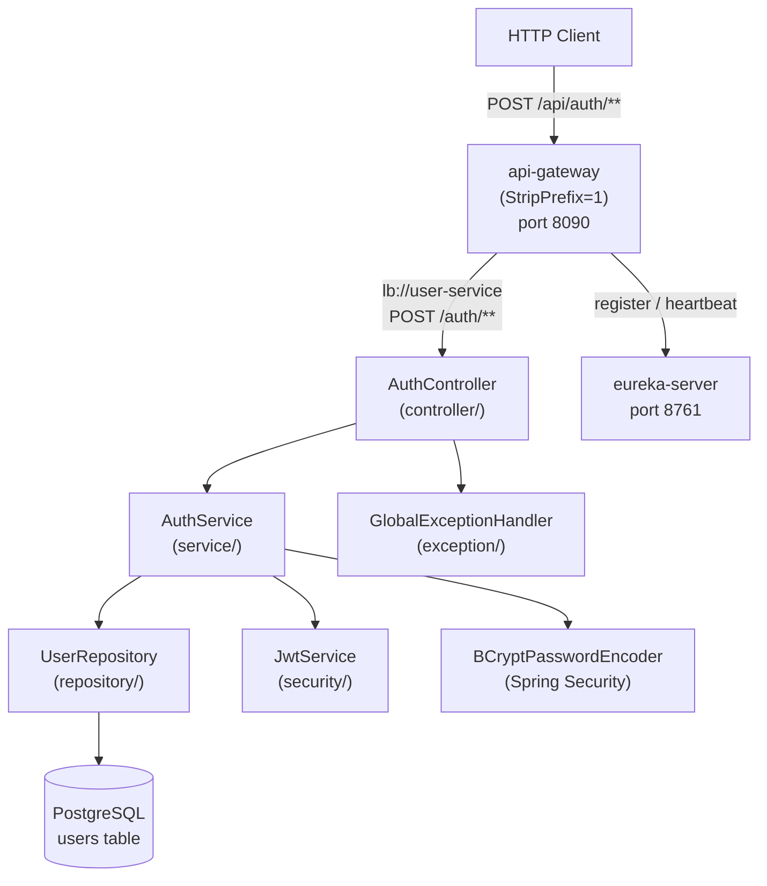

# Design Document: User Service (Phase 3)

## Overview

The User Service is the Phase 3 microservice of the ai-workflow-microservices platform. It provides stateless JWT-based authentication: users register with a username, email, and password; the service stores a BCrypt-hashed password and returns a signed JWT on success. Login validates credentials against the stored hash and returns a new JWT. The service is a standalone Spring Boot application backed by PostgreSQL, registers with the Eureka Server as `user-service`, and is accessible through the API Gateway at `/api/auth/**`.

**Startup order for local development:**
1. `eureka-server` (port 8761)
2. `api-gateway` (port 8090)
3. `user-service` (port 8081) — registers with Eureka, accessible via gateway at `/api/auth/**`

---

## Architecture



**Key design decisions:**
- DTOs are used at the API boundary; the `User` JPA entity is never exposed directly.
- `AuthService` is an interface — `AuthServiceImpl` contains all business logic; the interface allows mocking in tests.
- `JwtService` encapsulates all token operations (generate, extract, validate); `JwtProperties` binds `jwt.secret` and `jwt.expiration-ms` from configuration.
- `BCryptPasswordEncoder` is a Spring Security bean — injected into `AuthServiceImpl` for encoding and matching. Work factor defaults to 10 rounds, configurable via `security.bcrypt-strength`.
- A `@ControllerAdvice` `GlobalExceptionHandler` centralises all error responses, including `DataIntegrityViolationException` for concurrent duplicate registration.
- Spring Security is configured as fully stateless (no sessions, CSRF disabled); `/auth/**`, `/actuator/**`, and Swagger endpoints are publicly accessible.
- JWT tokens follow the Bearer convention — clients send `Authorization: Bearer <token>`. The `jwt.secret` is injected via environment variable and must be ≥ 256 bits.

---

## Components and Interfaces

### REST Layer — `AuthController`

| Method | Path | Status | Description |
|--------|------|--------|-------------|
| `POST` | `/auth/register` | 201 | Register a new user, returns `AuthResponse` |
| `POST` | `/auth/login` | 200 | Authenticate an existing user, returns `AuthResponse` |

All endpoints consume and produce `application/json`. Both endpoints are annotated with SpringDoc `@Operation` and `@ApiResponse`.

### Service Layer — `AuthService`

```java
public interface AuthService {
    AuthResponse register(RegisterRequest request);
    AuthResponse login(LoginRequest request);
}
```

`AuthServiceImpl` logic:
- **register**: check `existsByUsername` and `existsByEmail` (throw `UserAlreadyExistsException` on conflict), encode password with `BCryptPasswordEncoder`, save `User`, call `JwtService.generateToken`, return `AuthResponse`.
- **login**: find user by username (throw `InvalidCredentialsException` if absent), verify password with `BCryptPasswordEncoder.matches` (throw `InvalidCredentialsException` if mismatch), call `JwtService.generateToken`, return `AuthResponse`.

### Repository Layer — `UserRepository`

```java
public interface UserRepository extends JpaRepository<User, UUID> {
    Optional<User> findByUsername(String username);
    boolean existsByUsername(String username);
    boolean existsByEmail(String email);
}
```

### JWT Infrastructure

```java
@ConfigurationProperties(prefix = "jwt")
public class JwtProperties {
    private String secret;       // injected via JWT_SECRET env var; must be ≥ 256 bits
    private long expirationMs;   // injected via JWT_EXPIRATION_MS env var
}

public class JwtService {
    // Generates a signed JWT with claims: sub=username, iat=now, exp=now+expirationMs
    String generateToken(String username);

    // Extracts the sub (username) claim from a valid token
    String extractUsername(String token);

    // Returns true iff signature is valid AND token is not expired
    boolean isTokenValid(String token);
}
```

`JwtService` uses JJWT 0.12.5 with HMAC-SHA256. The secret is read from `JwtProperties.secret` (minimum 256 bits / 32 bytes). The generated token includes `sub`, `iat`, and `exp` claims. Clients use the token as `Authorization: Bearer <token>`.

### Security Configuration — `SecurityConfig`

```java
@Configuration
@EnableWebSecurity
public class SecurityConfig {
    @Bean SecurityFilterChain filterChain(HttpSecurity http) throws Exception {
        // sessionManagement: STATELESS
        // csrf: disabled
        // authorizeHttpRequests:
        //   /auth/**, /actuator/**, /swagger-ui/**, /v3/api-docs/** → permitAll
        //   anyRequest → authenticated
    }

    @Bean PasswordEncoder passwordEncoder() {
        // BCrypt with configurable strength (default 10 rounds)
        return new BCryptPasswordEncoder(bcryptStrength);
    }
}
```

BCrypt strength defaults to 10 rounds and is configurable via `security.bcrypt-strength`. Username lookups are case-sensitive — `Alice` and `alice` are distinct users.

### Exception Handler — `GlobalExceptionHandler`

| Exception | HTTP Status |
|-----------|-------------|
| `UserAlreadyExistsException` | 409 |
| `InvalidCredentialsException` | 401 |
| `DataIntegrityViolationException` | 409 (concurrent duplicate registration) |
| `MethodArgumentNotValidException` | 400 |
| `HttpMessageNotReadableException` | 400 |
| `Exception` (catch-all) | 500 |

`DataIntegrityViolationException` is caught to handle the race condition where two concurrent registrations with the same username/email both pass the application-level `existsBy*` check but one fails at the database constraint level.

---

## Data Models

### JPA Entity — `User` (`entity/`)

```java
@Entity
@Table(name = "users",
       uniqueConstraints = {
           @UniqueConstraint(columnNames = "username"),
           @UniqueConstraint(columnNames = "email")
       })
public class User {
    @Id @GeneratedValue(strategy = GenerationType.UUID)
    private UUID id;                    // unique identifier

    @Column(nullable = false, unique = true, length = 50)
    private String username;            // case-sensitive, 3–50 chars

    @Column(nullable = false, unique = true)
    private String email;               // valid email format, unique

    @Column(nullable = false)
    private String password;            // BCrypt hash — NEVER plaintext

    @Version
    private Long version;               // optimistic locking
}
```

The `password` field stores only the BCrypt hash. The field is named `password` in the entity but represents `passwordHash` semantically — plaintext is never written to this column.

### Request / Response DTOs

```java
public record RegisterRequest(
    @NotBlank @Size(min = 3, max = 50) String username,
    @Email @NotBlank String email,
    // min 8, max 100; must contain ≥1 uppercase, ≥1 lowercase, ≥1 digit, ≥1 special char
    @NotBlank @Size(min = 8, max = 100) @ValidPassword String password
) {}

public record LoginRequest(
    @NotBlank String username,
    @NotBlank String password
) {}

public record AuthResponse(
    UUID userId,
    String username,
    String token    // JWT Bearer token — use as: Authorization: Bearer <token>
) {}
```

`@ValidPassword` is a custom Bean Validation constraint that enforces the password strength rules (uppercase, lowercase, digit, special character). It is applied at the DTO level so validation occurs before the service layer is invoked.

### Database Schema (Flyway)

```sql
-- V1__create_users.sql
CREATE TABLE users (
    id       UUID         PRIMARY KEY DEFAULT gen_random_uuid(),
    username VARCHAR(50)  NOT NULL,
    email    VARCHAR(255) NOT NULL,
    password VARCHAR(255) NOT NULL,
    version  BIGINT       NOT NULL DEFAULT 0,
    CONSTRAINT uq_users_username UNIQUE (username),
    CONSTRAINT uq_users_email    UNIQUE (email)
);
```

### API Gateway Route Addition (`services/api-gateway/application.yml`)

```yaml
- id: user-service
  uri: lb://user-service
  predicates:
    - Path=/api/auth/**
  filters:
    - StripPrefix=1
```

---

## Correctness Properties

*A property is a characteristic or behavior that should hold true across all valid executions of a system — essentially, a formal statement about what the system should do. Properties serve as the bridge between human-readable specifications and machine-verifiable correctness guarantees.*

---

### Property 1: Registered user token is valid and contains correct username

*For any* valid registration request (non-blank username 3–50 chars, valid email, password 8–100 chars), after `POST /auth/register` succeeds with HTTP 201, the returned `token` SHALL be a valid JWT (signature valid, not expired) and `JwtService.extractUsername(token)` SHALL return the registered `username`.

**Validates: Requirements 1.1, 3.2, 3.5**

---

### Property 2: Duplicate username is rejected

*For any* username that has already been registered, a second `POST /auth/register` request using the same username (regardless of email or password) SHALL return HTTP 409 and no additional User record SHALL be created in the database.

**Validates: Requirements 1.2, 5.4**

---

### Property 3: Duplicate email is rejected

*For any* email address that has already been registered, a second `POST /auth/register` request using the same email (regardless of username or password) SHALL return HTTP 409 and no additional User record SHALL be created in the database.

**Validates: Requirements 1.3, 5.5**

---

### Property 4: Invalid credentials are rejected

*For any* login attempt where either the username does not exist in the database or the provided password does not match the stored BCrypt hash, `POST /auth/login` SHALL return HTTP 401. Both failure cases SHALL return the same HTTP status code, revealing no information about which field was incorrect.

**Validates: Requirements 2.2, 2.3, 2.5**

---

### Property 5: Password is never stored in plaintext

*For any* registered User, the value stored in the `password` column of the `users` table SHALL NOT equal the plaintext password provided in the `RegisterRequest`. The stored value SHALL be a BCrypt hash that `BCryptPasswordEncoder.matches(plaintext, stored)` returns `true` for.

**Validates: Requirements 1.9**

---

### Property 6: Validation rejects invalid inputs

*For any* `POST /auth/register` request where at least one of the following conditions holds — `username` is blank, `username` length is outside [3, 50], `email` does not conform to a valid email format, `password` is blank, or `password` length is outside [8, 100] — the User_Service SHALL return HTTP 400 and SHALL NOT create a User record.

**Validates: Requirements 1.4, 1.5, 1.6, 1.7, 1.8**

---

### Property 7: JWT token round-trip

*For any* non-blank username string, a token generated by `JwtService.generateToken(username)` SHALL satisfy all of the following: `JwtService.isTokenValid(token)` returns `true`, and `JwtService.extractUsername(token)` returns a value equal to the original `username`.

**Validates: Requirements 3.1, 3.2, 3.4, 3.5**

---

## Error Handling

| Scenario | HTTP Status | Response Body |
|----------|-------------|---------------|
| Username already exists | 409 | `{ "error": "User already exists" }` |
| Email already exists | 409 | `{ "error": "User already exists" }` |
| Concurrent duplicate (DB constraint) | 409 | `{ "error": "User already exists" }` |
| Invalid credentials | 401 | `{ "error": "Invalid credentials" }` |
| Validation failure | 400 | `{ "error": "Validation failed", "details": [...] }` |
| Malformed JSON | 400 | `{ "error": "Malformed request body" }` |
| Unhandled exception | 500 | `{ "error": "Internal server error" }` |

Error responses never include stack traces or internal implementation details. The 401 response for login is identical whether the username is unknown or the password is wrong — this prevents user enumeration.

## Security Constraints

- `jwt.secret` MUST NOT be hardcoded in source code. It is provided via the `JWT_SECRET` environment variable. A default value is permitted only for local development and MUST NOT be used in production.
- `jwt.secret` MUST be at least 256 bits (32 bytes / 64 hex characters) to satisfy HMAC-SHA256 minimum key length.
- BCrypt work factor is 10 rounds by default, configurable via `security.bcrypt-strength`. Higher values increase resistance to brute-force at the cost of registration/login latency.
- Rate limiting is NOT implemented in Phase 3. It may be introduced in a future phase via API Gateway filters.
- Username comparisons are case-sensitive at both the application and database level.

---

## Testing Strategy

### Unit Tests (JUnit 5 + Mockito)
- `AuthControllerTest`: `@WebMvcTest` with `MockMvc`; verify HTTP status codes, validation errors, and response shapes for all endpoints and error paths.
- `JwtServiceTest`: unit tests for `generateToken` (non-blank output), `extractUsername` (correct subject), and `isTokenValid` (true for fresh token, false for tampered/expired token).

### Property-Based Tests (jqwik)

Minimum 100 iterations per property. Each test annotated with:
```
// Feature: user-service, Property <N>: <property_text>
```

| Property | Test description |
|----------|-----------------|
| Property 1 | For any valid registration, returned token is valid JWT containing the registered username |
| Property 2 | For any registered username, re-registering with same username returns 409 |
| Property 3 | For any registered email, re-registering with same email returns 409 |
| Property 4 | For any non-existent username or wrong password, login returns 401 |
| Property 5 | For any registered user, stored password hash does not equal plaintext |
| Property 6 | For any invalid registration input, service returns 400 and no user is created |
| Property 7 | For any username string, generateToken then extractUsername returns original username |

### Integration Tests (Spring Boot Test + Testcontainers)
- Real PostgreSQL container via Testcontainers.
- `AuthIntegrationTest` covers: register returns token, duplicate username returns 409, login returns token, wrong password returns 401.
- Verify Flyway migrations (`V1__create_users.sql`) apply cleanly on startup.

### Property-Based Test Configuration

Each property test uses jqwik with a minimum of 100 tries. Tag format:
- **Feature: user-service, Property 1: Registered user token is valid and contains correct username**
- **Feature: user-service, Property 2: Duplicate username is rejected**
- **Feature: user-service, Property 3: Duplicate email is rejected**
- **Feature: user-service, Property 4: Invalid credentials are rejected**
- **Feature: user-service, Property 5: Password is never stored in plaintext**
- **Feature: user-service, Property 6: Validation rejects invalid inputs**
- **Feature: user-service, Property 7: JWT token round-trip**

### What Is NOT Tested
- JWT expiration timing (time-dependent; covered by configuration review)
- BCrypt work factor tuning (library concern, not business logic)
- Eureka heartbeat timing and eviction (covered by Eureka library's own tests)
- Logging output format (not a meaningful automated assertion)
