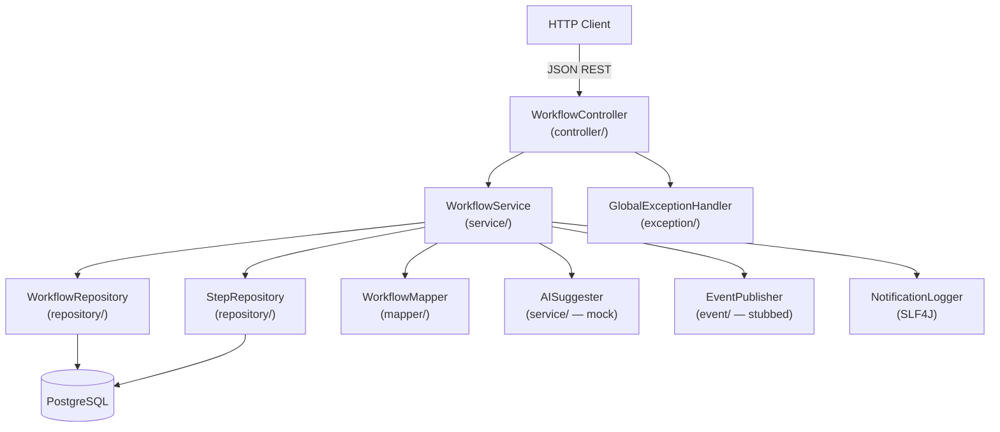

# Design Document: Workflow Service

## Overview

The Workflow Service is the Phase 1 (MVP) core microservice of the ai-workflow-microservices platform. It manages the lifecycle of workflows and their steps, provides a mock AI step suggestion, stubs Kafka event publishing, and logs notifications. It is a standalone Spring Boot application backed by PostgreSQL, following the platform's layered architecture: Controller → Service → Repository.

---

## Architecture



**Key design decisions:**
- DTOs are used at the API boundary; JPA entities are never exposed directly.
- `AISuggester` is an interface — the Phase 1 impl is a deterministic mock; a real OpenAI impl slots in later.
- `EventPublisher` is an interface — the Phase 1 impl logs to SLF4J; a real Kafka impl slots in Phase 5.
- `NotificationLogger` wraps SLF4J and is called explicitly from the service layer.
- A `@ControllerAdvice` global exception handler centralises all error responses.

---

## Components and Interfaces

### REST Layer — `WorkflowController`

| Method | Path | Status | Description |
|--------|------|--------|-------------|
| `POST` | `/workflows` | 201 | Create workflow |
| `GET` | `/workflows/{id}` | 200 | Get workflow with steps |
| `POST` | `/workflows/{id}/steps` | 201 | Add step, returns step + AI suggestion |
| `POST` | `/workflows/{workflowId}/steps/{stepId}/complete` | 200 | Mark step as completed |

All endpoints consume and produce `application/json`.

### Service Layer — `WorkflowService`

```java
public interface WorkflowService {
    WorkflowResponse createWorkflow(CreateWorkflowRequest request);
    WorkflowResponse getWorkflow(UUID id);
    AddStepResponse addStep(UUID workflowId, AddStepRequest request);
    WorkflowResponse completeStep(UUID workflowId, UUID stepId);
}
```

### Repository Layer

```java
public interface WorkflowRepository extends JpaRepository<Workflow, UUID> {}

public interface StepRepository extends JpaRepository<Step, UUID> {
    List<Step> findByWorkflowId(UUID workflowId);
}
```

### AI Suggester — `AISuggester`

```java
public interface AISuggester {
    String suggestNextStep(String workflowName, List<String> existingStepNames);
}
```

Phase 1 mock implementation returns: `"Suggested next step for '<workflowName>' (step <N+1>)"`.

### Event Publisher — `EventPublisher`

```java
public interface EventPublisher {
    void publishWorkflowCreated(UUID workflowId, String workflowName);  // event: workflow.created
    void publishStepAdded(UUID workflowId, UUID stepId, String stepName); // event: step.created
    void publishStepCompleted(UUID workflowId, UUID stepId);              // event: step.completed
}
```

Phase 1 stub logs the event via SLF4J at INFO level and swallows all exceptions.

### Notification Logger — `NotificationLogger`

```java
public class NotificationLogger {
    void logWorkflowCreated(UUID workflowId, String workflowName);    // INFO: workflowId={} workflowName={}
    void logStepAdded(UUID stepId, String stepName, UUID workflowId); // INFO: stepId={} stepName={} workflowId={}
    void logStepCompleted(UUID stepId, UUID workflowId);              // INFO: stepId={} workflowId={}
    void logError(String message, Throwable cause);                   // ERROR
}
```

### Exception Handler — `GlobalExceptionHandler`

| Exception | HTTP Status |
|-----------|-------------|
| `WorkflowNotFoundException` | 404 |
| `MethodArgumentNotValidException` | 400 |
| `HttpMessageNotReadableException` | 400 |
| `Exception` (catch-all) | 500 |

---

## Data Models

### JPA Entity — `Workflow` (`entity/`)

```java
@Entity
@Table(name = "workflows")
public class Workflow {
    @Id @GeneratedValue(strategy = GenerationType.UUID)
    private UUID id;

    @Column(nullable = false)
    private String name;

    @Enumerated(EnumType.STRING)
    @Column(nullable = false)
    private WorkflowStatus status;  // enums/WorkflowStatus

    @OneToMany(mappedBy = "workflow", cascade = CascadeType.ALL, fetch = FetchType.LAZY)
    private List<Step> steps = new ArrayList<>();
}
```

### JPA Entity — `Step` (`entity/`)

```java
@Entity
@Table(name = "steps")
public class Step {
    @Id @GeneratedValue(strategy = GenerationType.UUID)
    private UUID id;

    @ManyToOne(fetch = FetchType.LAZY)
    @JoinColumn(name = "workflow_id", nullable = false)
    private Workflow workflow;

    @Column(nullable = false)
    private String name;

    @Enumerated(EnumType.STRING)
    @Column(nullable = false)
    private StepStatus status;  // enums/StepStatus
}
```

### Request / Response DTOs

```java
record CreateWorkflowRequest(@NotBlank String name) {}

record AddStepRequest(@NotBlank String name) {}

record WorkflowResponse(UUID id, String name, WorkflowStatus status, List<StepResponse> steps) {}

record StepResponse(UUID id, UUID workflowId, String name, StepStatus status) {}

record AddStepResponse(StepResponse step, String suggestedNextStep) {}
```

### Database Schema (Flyway)

```sql
-- V1__create_workflows.sql
CREATE TABLE workflows (
    id     UUID PRIMARY KEY DEFAULT gen_random_uuid(),
    name   VARCHAR(255) NOT NULL,
    status VARCHAR(50)  NOT NULL
);

-- V2__create_steps.sql
CREATE TABLE steps (
    id          UUID PRIMARY KEY DEFAULT gen_random_uuid(),
    workflow_id UUID        NOT NULL REFERENCES workflows(id),
    name        VARCHAR(255) NOT NULL,
    status      VARCHAR(50)  NOT NULL
);
```

---

## Correctness Properties

### Property 1: Created workflow is retrievable with correct initial state

For any valid workflow name, after `POST /workflows` succeeds, `GET /workflows/{id}` shall return a workflow with the same name, status `CREATED`, and an empty steps list.

**Validates: Requirements 1.1, 1.3, 1.4, 2.1**

---

### Property 2: Invalid workflow creation is rejected

For any `POST /workflows` request with a blank or missing name, the service shall return HTTP 400 and the total number of workflows shall remain unchanged.

**Validates: Requirement 1.2**

---

### Property 3: Step addition transitions workflow status

For any workflow in status `CREATED`, after a valid `POST /workflows/{id}/steps`, the workflow status shall be `IN_PROGRESS` and the step shall appear in `GET /workflows/{id}` with status `PENDING`.

**Validates: Requirements 3.1, 3.4, 3.5, 2.3**

---

### Property 4: AI suggestion is always present in add-step response

For any valid add-step request, the response shall contain a non-null, non-blank `suggestedNextStep` string.

**Validates: Requirements 4.1, 4.2, 4.3**

---

### Property 5: Non-existent workflow returns 404

For any UUID that does not correspond to a persisted workflow, both `GET /workflows/{id}` and `POST /workflows/{id}/steps` shall return HTTP 404.

**Validates: Requirements 2.2, 3.2**

---

### Property 6: Event publisher never throws

For any workflow creation or step addition, even when the event publisher encounters an error, the primary operation shall succeed and return the expected HTTP status.

**Validates: Requirement 5.3**

### Property 7: Completing all steps transitions workflow to COMPLETED

For any workflow with N steps where all steps are marked completed one by one, after the final `completeStep` call the workflow status shall be `COMPLETED`.

**Validates: Requirements 4.3**

| Scenario | HTTP Status | Response Body |
|----------|-------------|---------------|
| Workflow not found | 404 | `{ "error": "Workflow not found", "id": "<id>" }` |
| Blank name | 400 | `{ "error": "Validation failed", "details": [...] }` |
| Malformed JSON | 400 | `{ "error": "Malformed request body" }` |
| Unhandled exception | 500 | `{ "error": "Internal server error" }` |

---

## Testing Strategy

### Unit Tests (JUnit 5 + Mockito)
- `WorkflowServiceImpl`: mock repositories, `AISuggester`, `EventPublisher`, `NotificationLogger`; verify all business logic paths.
- `WorkflowController`: `@WebMvcTest` with `MockMvc`; verify HTTP status codes, validation, and response shapes.
- `MockAISuggester`: verify deterministic output formula.
- `StubEventPublisher`: verify it never throws even when an internal error occurs.

### Property-Based Tests (jqwik)
Minimum 100 iterations per property. Each test annotated with:
```
// Feature: workflow-service, Property <N>: <property_text>
```

| Property | Test description |
|----------|-----------------|
| Property 1 | For any valid name, create then get returns matching workflow in CREATED state |
| Property 2 | For any blank/null name, create returns 400 and count unchanged |
| Property 3 | For any CREATED workflow, add step → status becomes IN_PROGRESS, step is PENDING |
| Property 4 | For any valid add-step, response contains non-blank suggestedNextStep |
| Property 5 | For any random UUID, get and add-step return 404 |
| Property 6 | For any add-step, event publisher error does not fail the request |

### Integration Tests (Spring Boot Test + Testcontainers)
- Real PostgreSQL container via Testcontainers.
- Full stack exercise for each endpoint.
- Verify Flyway migrations apply cleanly on startup.
