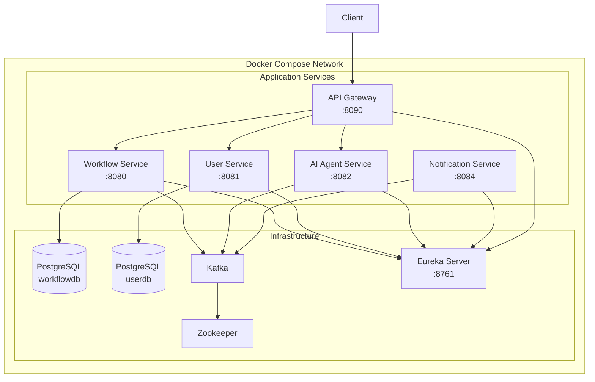

# AI Workflow Microservices

A microservices platform for managing AI-powered workflows. The system provides workflow creation and tracking, user authentication, AI-driven workflow suggestions, and event-driven notifications — all orchestrated through a service discovery registry and API gateway.

## Architecture

The platform runs as a set of containerized Spring Boot services connected via Kafka for asynchronous messaging, PostgreSQL for persistence, and Eureka for service discovery. The API Gateway provides a single entry point for all client requests.



## Services

| Service | Description | Port | Stack |
|---------|-------------|------|-------|
| workflow-service | Manages workflows and steps | 8080 | Spring Boot 3.2.5, PostgreSQL, Flyway, Kafka |
| user-service | User registration and JWT authentication | 8081 | Spring Boot 3.2.5, PostgreSQL, Flyway, JWT |
| ai-agent-service | AI-powered workflow suggestions | 8082 | Spring Boot 3.2.5, Kafka, OpenAI/Groq |
| notification-service | Event-driven notifications | 8084 | Spring Boot 3.2.5, Kafka |
| eureka-server | Service discovery registry | 8761 | Spring Boot 3.2.5, Netflix Eureka |
| api-gateway | API routing and load balancing | 8090 | Spring Boot 3.2.5, Spring Cloud Gateway |

## Prerequisites

| Tool | Version | Notes |
|------|---------|-------|
| Java | 17 | Eclipse Temurin recommended |
| Maven | 3.8+ | For building services from source |
| Docker Desktop | Latest | For containerized deployment |
| PostgreSQL | 16 | Only needed for local development without Docker |

## Quick Start: Local Development

Run services directly on your machine without Docker. This requires PostgreSQL and Kafka running locally.

### 1. Start PostgreSQL and create databases

```bash
# Start PostgreSQL (if not already running)
pg_ctl start

# Create the required databases
createdb workflowdb
createdb userdb
```

### 2. Start Zookeeper and Kafka

```bash
# Start Zookeeper
bin/zookeeper-server-start.sh config/zookeeper.properties

# Start Kafka (in a separate terminal)
bin/kafka-server-start.sh config/server.properties
```

### 3. Start Eureka Server (start this first)

```bash
cd services/eureka-server
mvn spring-boot:run
```

Wait until Eureka is available at [http://localhost:8761](http://localhost:8761) before starting other services.

### 4. Start application services

Open a separate terminal for each service:

```bash
# Workflow Service
cd services/workflow-service
mvn spring-boot:run

# User Service
cd services/user-service
mvn spring-boot:run

# AI Agent Service
cd services/ai-agent-service
mvn spring-boot:run

# Notification Service
cd services/notification-service
mvn spring-boot:run
```

### 5. Start API Gateway (start this last)

```bash
cd services/api-gateway
mvn spring-boot:run
```

The API Gateway will be available at [http://localhost:8090](http://localhost:8090).

## Quick Start: Docker Compose

Run the entire platform with a single command using Docker Compose.

### 1. Configure environment variables

```bash
cd infra/docker
cp .env.example .env
```

Edit `.env` and fill in the required secrets:

- `POSTGRES_WORKFLOW_PASSWORD` — password for the workflow database
- `POSTGRES_USER_PASSWORD` — password for the user database
- `JWT_SECRET` — secret key for JWT token signing
- `GROQ_API_KEY` — API key for the Groq AI service

### 2. Start all services

```bash
docker compose up --build
```

This builds all service images from source and starts the full platform. Services start in dependency order — infrastructure first (PostgreSQL, Kafka, Eureka), then application services.

### 3. Stop services

```bash
# Stop all services (preserves database volumes)
docker compose down

# Stop all services and remove database volumes
docker compose down -v
```

## API Endpoints

### Workflow Service

| Method | Path | Description |
|--------|------|-------------|
| POST | `/workflows` | Create a new workflow |
| GET | `/workflows/{id}` | Get a workflow by ID |
| POST | `/workflows/{id}/steps` | Add a step to a workflow |
| POST | `/workflows/{workflowId}/steps/{stepId}/complete` | Complete a step |

### User Service

| Method | Path | Description |
|--------|------|-------------|
| POST | `/auth/register` | Register a new user |
| POST | `/auth/login` | Login with username and password |

### AI Agent Service

| Method | Path | Description |
|--------|------|-------------|
| POST | `/suggestions` | Generate a next-step suggestion for a workflow |

## Event Model

| Topic | Producer | Consumer | Description |
|-------|----------|----------|-------------|
| `workflow.created` | workflow-service | ai-agent-service, notification-service | Emitted when a new workflow is created |
| `step.created` | workflow-service | notification-service | Emitted when a step is added to a workflow |
| `step.completed` | workflow-service | notification-service | Emitted when a workflow step is completed |
| `ai.suggestion.generated` | ai-agent-service | notification-service | Emitted when an AI suggestion is generated for a workflow |

## Environment Variables

All services are configured through environment variables with sensible defaults for local development. Override these when deploying with Docker Compose or to a remote environment.

| Variable | Default | Description |
|----------|---------|-------------|
| `SPRING_DATASOURCE_URL` | `jdbc:postgresql://localhost:5432/workflowdb` | JDBC connection URL for the database |
| `SPRING_DATASOURCE_USERNAME` | `postgres` | Database username |
| `SPRING_DATASOURCE_PASSWORD` | `postgres` | Database password |
| `KAFKA_BOOTSTRAP_SERVERS` | `localhost:9092` | Kafka broker address |
| `EUREKA_CLIENT_SERVICEURL_DEFAULTZONE` | `http://localhost:8761/eureka/` | Eureka service registry URL |
| `JWT_SECRET` | — | Secret key for JWT token signing (required) |
| `JWT_EXPIRATION_MS` | `86400000` | JWT token expiration in milliseconds (24h) |
| `GROQ_API_KEY` | — | API key for Groq AI service (required for ai-agent-service) |
| `OPENAI_MODEL` | `llama-3.1-8b-instant` | AI model name for suggestions |
| `LOG_LEVEL` | `INFO` | Root logging level (DEBUG, INFO, WARN, ERROR) |
| `SPRING_PROFILES_ACTIVE` | — | Active Spring profile (use `docker` for containerized deployment) |
